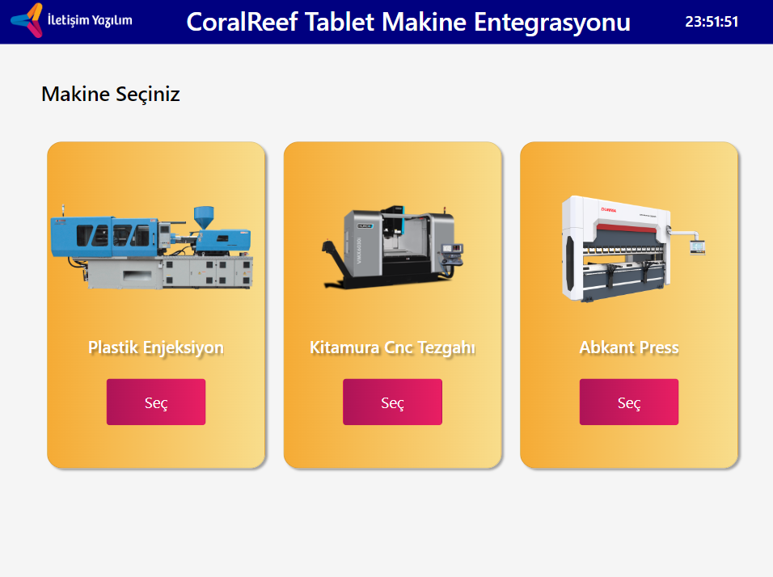
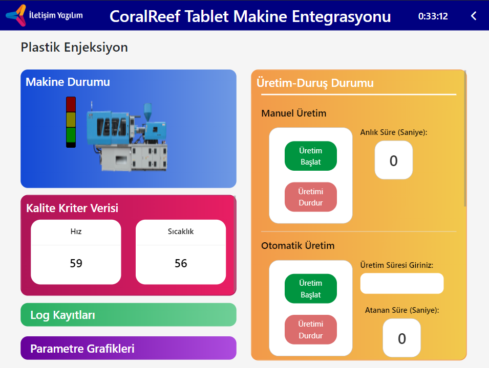
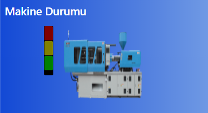
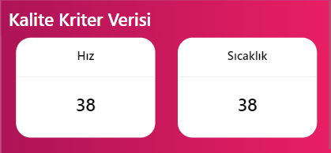
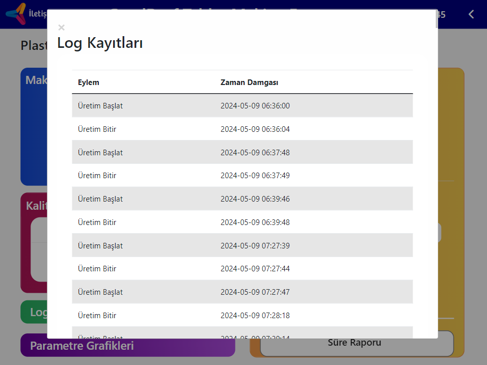
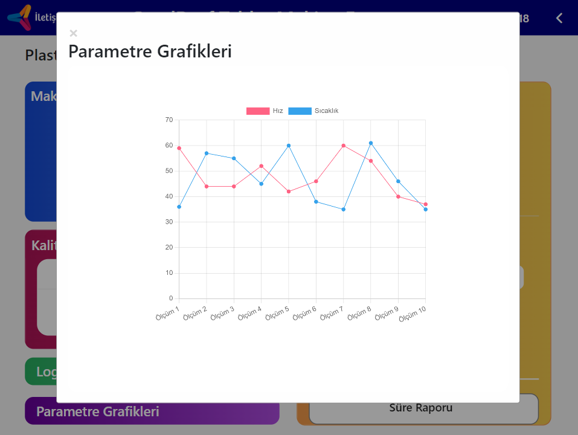
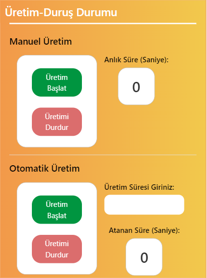
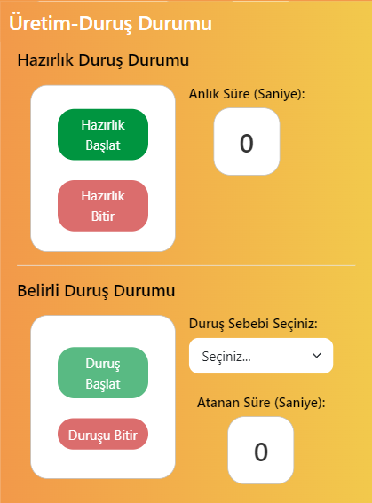

<h1>CoralReef Tablet Makine Entegrasyonu</h1> 
 
CoralReef Tablet Makine Entegrasyonu Projesi Sunumudur.
<h2>Proje Hakkında</h2>

  "CoralReef Tablet Makine Entegrasyonu" projesi, endüstriyel otomasyon ve üretim süreçlerinin modernizasyonu amacıyla tasarlanmış bir yazılım çözümüdür. Bu projenin temel hedefi, fabrikalarda kullanılan makinelerin dijital ikizlerini oluşturarak, bu ikizler aracılığıyla yapılan simülasyonlarla makinelerin operasyonel verimliliğini artırmaktır. Gerçek zamanlı veri toplama, arıza tahmin sistemleri ve etkin bakım yönetimi, bu projenin en önemli bileşenlerindendir.

 

<h2>Projenin Amacı ve Faydaları</h2>

Projede, fiziksel makinelerin çalışma koşulları ve performans özellikleri dijital ortama aktarılarak, simülasyonlar yoluyla analiz edilir. Bu simülasyonlar sayesinde, makinelerin maksimum verimle çalışması sağlanır, potansiyel arızalar önceden belirlenerek önlemler alınır ve bakım süreçleri optimize edilir. Bu yaklaşım, hem maliyet tasarrufu sağlar hem de üretim sürekliliğini garanti altına alır. Modbus kütüphanesi kullanılarak PLC'lerden alınan veriler, bu simülasyonların doğruluk ve güvenilirliğini destekler.

<h2>Makine Seçim Ekranı</h2>

 

CoralReef Tablet Makine Entegrasyonu uygulamasının "Makine Seçiniz" ekranı, kullanıcılara çeşitli makine türleri arasından seçim yapma imkanı sunar. Bu örnekte, Plastik Enjeksiyon, Kitamura CNC Tezgahı ve Abkant Pres olmak üzere üç farklı makinanın dijital ikizleri sergilenmektedir. Ekran, fabrika ortamındaki çeşitli makinelerin dijital ikizlerine erişim sağlamak için tasarlanmış temel bir arayüz olarak hizmet verir.

Bu arayüz, kullanıcıların farklı makineler arasında hızlı ve etkili bir şekilde seçim yapmalarını sağlar, böylece operasyonel verimlilik ve makine yönetimi süreçlerini kolaylaştırır. Her bir makine, kullanıcıya net bir görsel ve işlevsel bilgi sunacak şekilde tasarlanmıştır.

<h3>İşlem Akışı:</h3>

- **Makine Bağlantısı**: Kullanıcı, her bir makine kartına tıkladığında, sistem arka planda PLC'lerde tanımlı olan Modbus ID üzerinden makineye bağlantı kurmaya çalışır.
- **Bağlantı Durumu**: Bağlantı başarılı olduğunda, kullanıcı seçim işlemini tamamlar ve sistem, seçilen makine ile ilgili işlemlere geçiş yapar. Eğer bağlantı başarısız olursa veya herhangi bir hata meydana gelirse, sistem otomatik olarak bir hata uyarısı (pop-up) göstererek kullanıcıyı bilgilendirir ve problemi gidermek için gerekli adımları önerir.

<h3>Kullanıcı Arayüzü Tasarımı:</h3>

Arayüz, kullanıcı dostu bir deneyim sağlamak amacıyla tasarlanmıştır. Her makine, kolay tanınabilirlik için büyük, net resimler ve açık renkli arka planlarla vurgulanmıştır. Seçim butonları, interaktiflik katmak için dikkat çekici bir şekilde tasarlanmıştır.

Bu ekran, CoralReef Tablet Makine Entegrasyonu sisteminin merkezi bileşenlerinden biri olarak, kullanıcılara makine seçiminde kolaylık ve hız sunarak üretim süreçlerinin verimliliğini artırmayı amaçlar.

 

<h2>Makine Kontrol Paneli Özellikleri</h2>

"CoralReef Tablet Makine Entegrasyonu" uygulamasının "Makine Kontrol Paneli" ekranı, makinelerin operasyonel durumunu ve performansını gerçek zamanlı olarak izlemek ve yönetmek için kapsamlı araçlar ve bilgiler sunar. Bu panel, kullanıcılara makine operasyonları üzerinde derinlemesine kontrol ve gözlem imkanı sağlayarak, üretim süreçlerinin etkinliğini artırmak için tasarlanmıştır.

<h3>Makine Durumu Göstergesi:</h3>

Makine durumu göstergesi, seçilen makinenin anlık çalışma durumunu renk kodlu uyarı lambaları ile ifade eder:

- **Yeşil Lamba (Üretimde)**:Makine aktif olarak üretim yapmaktadır. Bu durum, süreçlerin sorunsuz ve verimli bir şekilde devam ettiğini gösterir.
- **Sarı Lamba (Hazırlıkta)**:Makine, üretim öncesi hazırlık aşamasındadır. Bu, makinenin bir sonraki üretim döngüsüne hazırlanmakta olduğunu belirtir.
- **Kırmızı Lamba (Durdurma)**: Üretim, belirli bir sorun nedeniyle durdurulmuştur. Bu, arıza veya bakım gibi nedenlerden kaynaklanabilir ve derhal dikkat gerektirir.

<h3>Kalite Kriterleri İzleme:</h3>

Modbus kütüphanesi aracılığıyla makineden alınan veriler, makinenin performans kriterlerini (hız ve sıcaklık gibi) sürekli olarak izler.Her makinenin kalite kriter verileri farklılık gösterir.Bu bölüm, üretim kalitesini güvence altına almak ve gerekirse ayar yapmak için kritik öneme sahiptir:

<h3>Log Kayıtları ve Olay İzleme:</h3>

Üretim, hazırlık, otomatik üretim, ve duruş gibi olayların tarih ve zaman damgasıyla loglandığı bölümdür. Bu kayıtlar, operasyonel verimliliği analiz etme ve süreçlerin iyileştirilmesi için değerli bir kaynaktır.

<h3>Parametre Grafikleri:</h3>

Makineden alınan kalite kriter verileri bu bölümde grafik üzerinde gösterilir. Her 15 saniyede bir güncellenen bu grafikler, parametrelerin zaman içindeki değişimini görsel olarak sunarak, trendleri ve potansiyel sorunları kolayca tespit etme imkanı sağlar.

<h3>Üretim ve Durdurma Yönetimi:</h3>

Bu bölüm, manuel ve otomatik üretim süreçlerini başlatma, durdurma ve belirli bir süre için planlama işlevlerini içerir. Ayrıca, makinenin duruş sebeplerini seçme ve duruş sürelerini atama gibi işlemleri de kapsar. Bu arayüzler, üretim süreçlerinin esnek ve etkin bir şekilde yönetilmesini sağlar.

<h4>Süre Raporu</h4>

Tüm üretim ve duruş süreçleri detaylı olarak raporlanır. Bu raporlar, operasyonel verimliliği değerlendirme ve süreç iyileştirmeleri için değerli bir kaynak olarak hizmet eder. Her bir üretim ve duruş olayı, süre ve tarih ile birlikte kaydedilir, bu da süreçlerin daha iyi anlaşılmasını ve yönetilmesini sağlar.

